# GeoCam Image Verification Flow Diagram

## Overview
This diagram illustrates the complete image verification process in the GeoCam app, showing how images are selected, analyzed, and verified using cryptographic signatures and steganography.

## Key Components
- **Private Key**: Stored securely on device, never transmitted
- **Public Key**: Shared with backend for verification
- **Steganography Service**: Extracts hidden metadata from images
- **Signature Verification**: Validates image authenticity using cryptographic signatures

---

## Complete Verification Flow

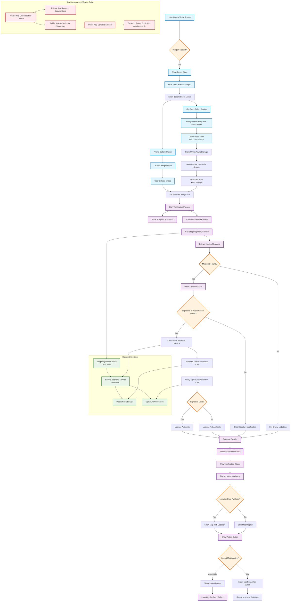

---

## Detailed Verification Steps

### 1. Image Selection Phase
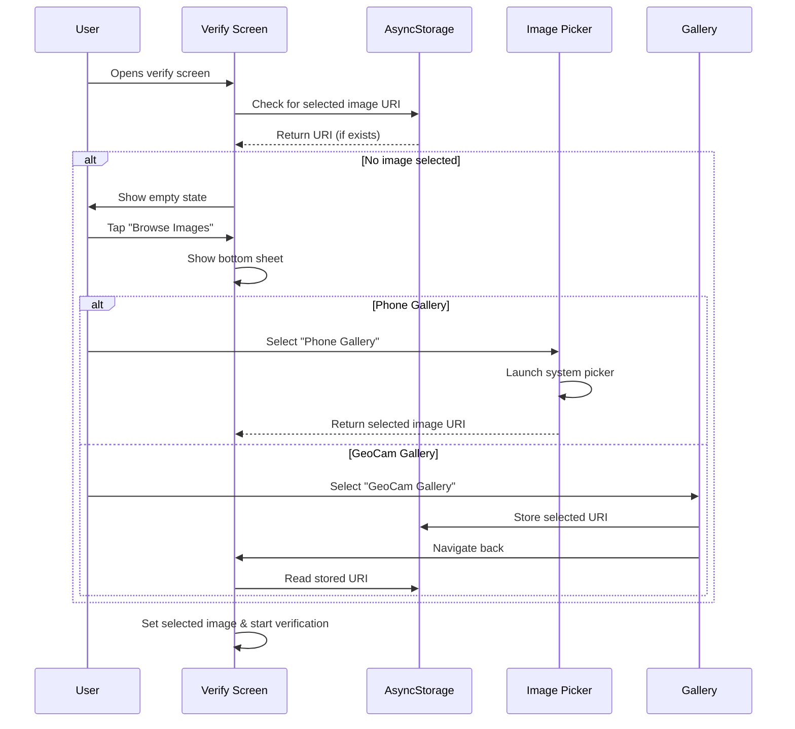

### 2. Steganography Extraction Phase
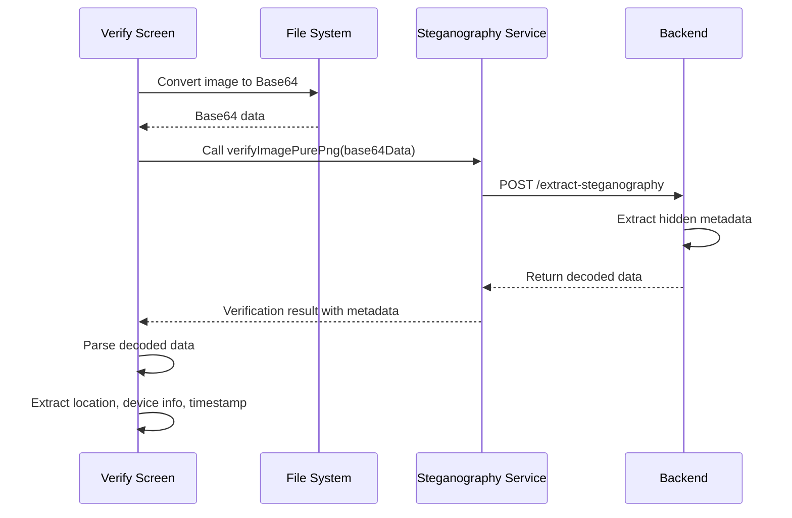

### 3. Signature Verification Phase
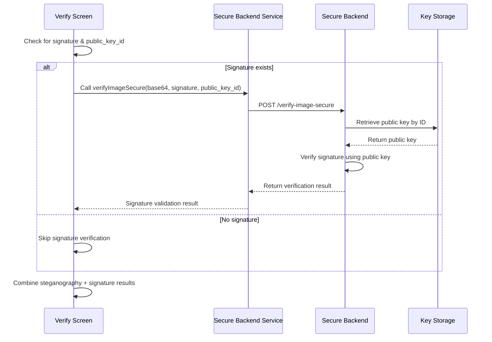

### 4. Key Management Flow
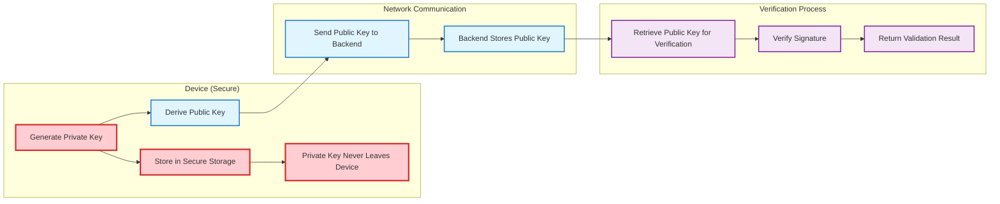

---

## Data Flow Architecture

### 1. Metadata Processing
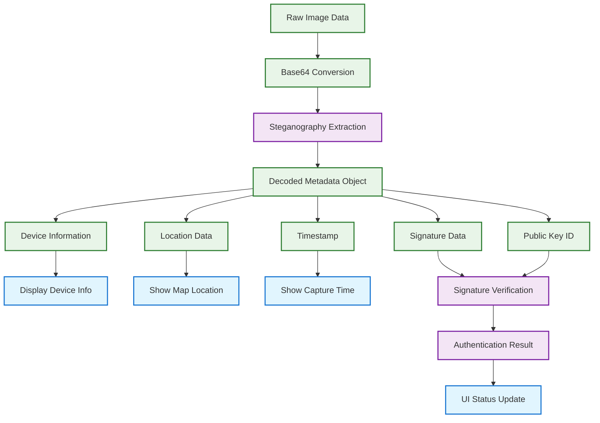

### 2. UI State Management
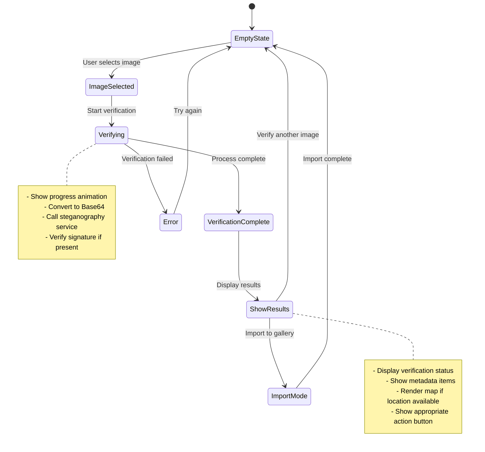

---

## Security Model

### Key Security Principles
1. **Private Key Isolation**: Private keys never leave the device
2. **Public Key Distribution**: Only public keys are transmitted to backend
3. **Signature Verification**: Backend uses public key to verify signatures
4. **Secure Storage**: Private keys stored in device secure storage
5. **No Key Transmission**: Verification process doesn't require private key transmission

### Cryptographic Flow
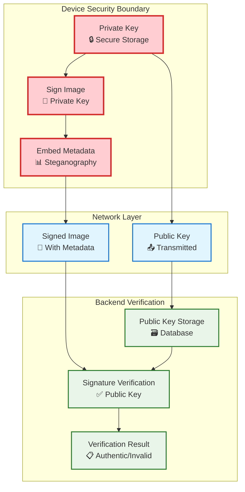

---

## Error Handling Flow

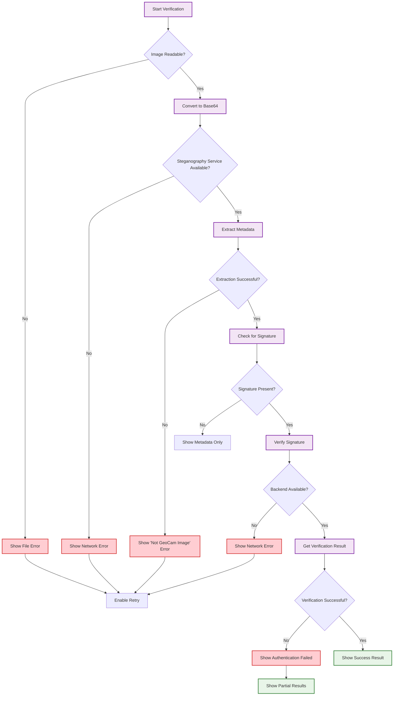

---

## Implementation Notes

### Key Technologies Used
- **React Native**: Mobile app framework
- **Expo**: Development platform and tools
- **AsyncStorage**: Local data persistence
- **Secure Storage**: Cryptographic key storage
- **File System**: Image file operations
- **Image Picker**: System image selection
- **Maps**: Location visualization
- **Steganography**: Hidden data embedding/extraction
- **Cryptographic Signatures**: Image authentication

### Performance Considerations
- Progress animation during verification (25-second simulation)
- Lazy loading of verification results
- Efficient Base64 conversion
- Optimized map rendering
- Smooth UI transitions

### User Experience Features
- Empty state with clear call-to-action
- Progress feedback during verification
- Animated scroll indicators
- Bottom sheet for source selection
- Responsive design for different screen sizes
- Dark/light theme support
- Import mode for external images

This comprehensive flow diagram illustrates how the GeoCam verification system maintains security while providing a seamless user experience for image authenticity verification.

---

## Complete Key Generation & Management Process

### Overview of Cryptographic Libraries and Their Roles

This section details the complete process from key generation to image verification, explaining how each library ensures private keys never leave the mobile device while enabling secure verification.

---

## 1. Private & Public Key Generation Process

### **Mobile Device Key Generation (Using @noble/curves)**

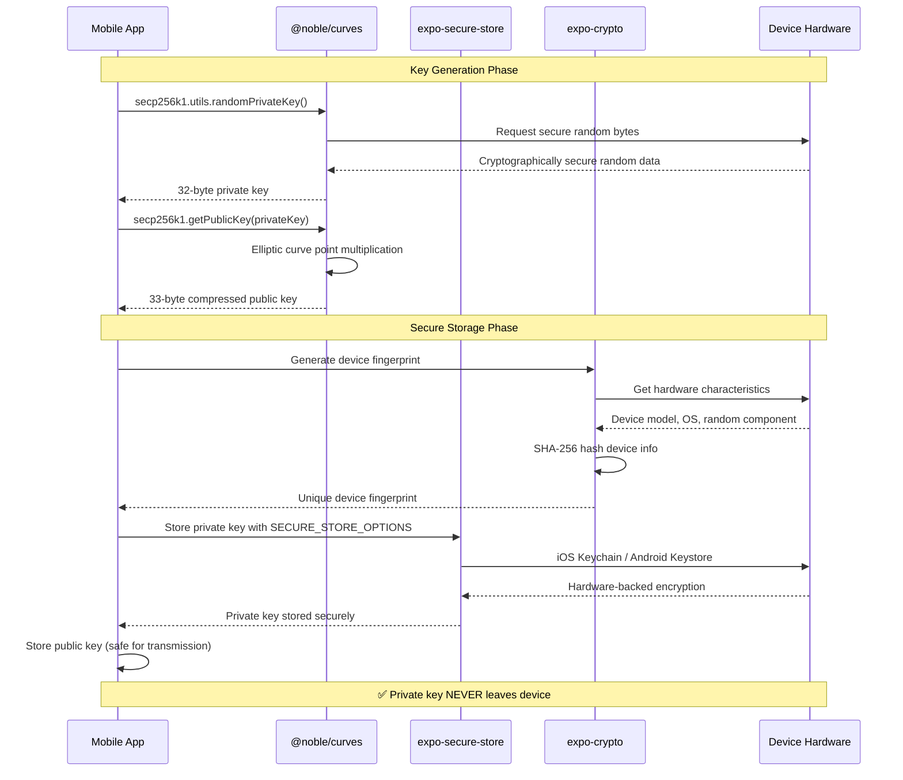

### **Library Responsibilities in Key Generation**

#### **@noble/curves v1.9.2 (Mobile Device)**
```typescript
// 1. Secure Private Key Generation
const privateKeyBytes = secp256k1.utils.randomPrivateKey();
// - Uses cryptographically secure random number generator
// - Generates 32-byte private key following secp256k1 standards
// - NO network dependencies, pure JavaScript implementation

// 2. Public Key Derivation
const publicKeyPoint = secp256k1.getPublicKey(privateKeyBytes);
// - Performs elliptic curve point multiplication: P = privateKey × G
// - Generates compressed 33-byte public key
// - Mathematically linked but computationally infeasible to reverse
```

#### **expo-secure-store v14.2.3 (Mobile Device)**
```typescript
// Hardware-Backed Secure Storage
await SecureStore.setItemAsync(
  PRIVATE_KEY_STORAGE_KEY,
  JSON.stringify(privateKeyData),
  {
    requireAuthentication: false, // Can enable biometric auth
    authenticationPrompt: 'Authenticate to access GeoCam keys',
    keychainService: 'com.geocam.secure.keychain',
    // iOS: Uses Keychain Services with hardware security
    // Android: Uses Android Keystore with hardware backing
  }
);
```

**Security Features:**
- **iOS Keychain**: Hardware-backed encryption using Secure Enclave (iPhone 5s+)
- **Android Keystore**: Hardware Security Module (HSM) when available
- **Biometric Protection**: Optional TouchID/FaceID/Fingerprint authentication
- **App Isolation**: Keys isolated per app, cannot be accessed by other apps
- **Device-Specific Encryption**: Keys encrypted with device-specific hardware keys

#### **expo-crypto v13.1.0 (Mobile Device)**
```typescript
// Device Fingerprint Generation
const deviceInfo = {
  model: Device.modelName,
  osName: Device.osName,
  osVersion: Device.osVersion,
  deviceType: Device.deviceType,
  randomComponent: await Crypto.getRandomBytesAsync(16) // Unique per installation
};

const fingerprint = await Crypto.digestStringAsync(
  Crypto.CryptoDigestAlgorithm.SHA256,
  JSON.stringify(deviceInfo),
  { encoding: Crypto.CryptoEncoding.HEX }
);
```

---

## 2. Image Signing Process (Private Key Usage)

### **Secure Image Signing Flow**

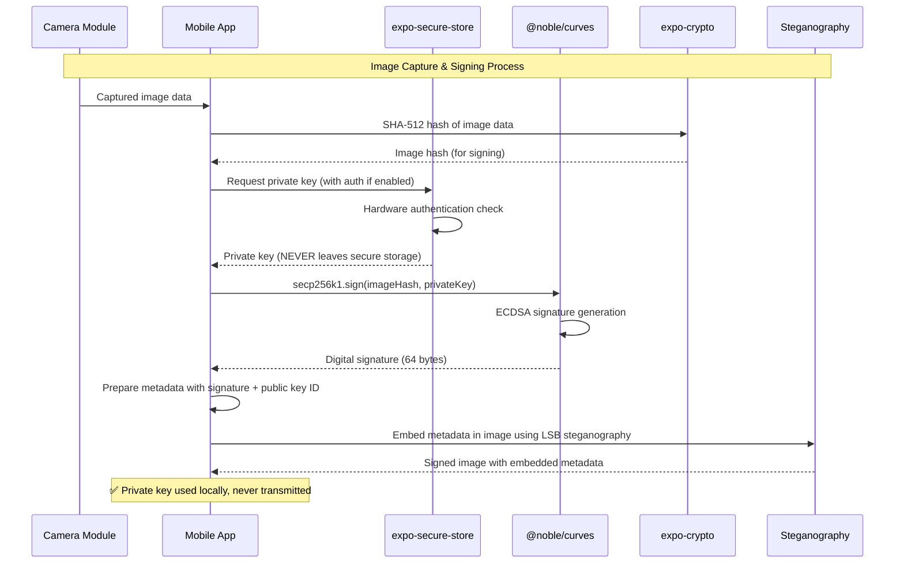

### **Image Signing Implementation Details**

```typescript
export const signImageDataSecurely = async (imageData: string, metadata: any): Promise<SignedImageData> => {
  // 1. Get private key from secure storage (NEVER transmitted)
  const privateKeyData = JSON.parse(
    await SecureStore.getItemAsync(PRIVATE_KEY_STORAGE_KEY, SECURE_STORE_OPTIONS)
  );
  
  // 2. Hash image data for signing
  const imageDataHash = await Crypto.digestStringAsync(
    Crypto.CryptoDigestAlgorithm.SHA512,
    imageData,
    { encoding: Crypto.CryptoEncoding.HEX }
  );
  
  // 3. Convert private key from storage format
  const privateKeyBytes = new Uint8Array(
    atob(privateKeyData.keyBase64).split('').map(c => c.charCodeAt(0))
  );
  
  // 4. Sign the image hash using secp256k1
  const hashBytes = new Uint8Array(
    imageDataHash.match(/.{1,2}/g)!.map(byte => parseInt(byte, 16))
  );
  
  const signature = secp256k1.sign(hashBytes, privateKeyBytes);
  const signatureBase64 = btoa(String.fromCharCode(...signature.toCompactRawBytes()));
  
  return {
    signature: signatureBase64,
    publicKeyId: publicKeyData.keyId, // Only public key ID transmitted
    timestamp: new Date().toISOString(),
    metadata
  };
};
```

---

## 3. Backend Verification Process (Using coincurve)

### **Backend Signature Verification Flow**

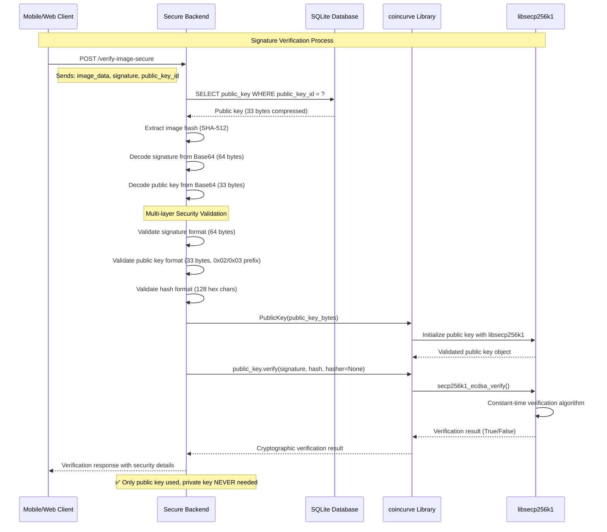

### **coincurve Library Role in Backend Verification**

#### **What coincurve Does:**
```python
def verify_secp256k1_signature(signature_base64: str, data_hash: str, public_key_base64: str) -> dict:
    """Production-grade signature verification using coincurve"""
    
    # 1. Decode binary data
    signature_bytes = base64.b64decode(signature_base64)  # 64 bytes
    public_key_bytes = base64.b64decode(public_key_base64)  # 33 bytes
    hash_bytes = bytes.fromhex(data_hash)  # 64 bytes (SHA-512)
    
    # 2. Initialize public key with libsecp256k1
    public_key = coincurve.PublicKey(public_key_bytes)
    # - coincurve wraps the Bitcoin Core libsecp256k1 library
    # - Provides production-grade, battle-tested cryptographic operations
    # - Used by Bitcoin network for over a decade
    
    # 3. Verify signature using constant-time algorithms
    signature_verified = public_key.verify(signature_bytes, hash_bytes, hasher=None)
    # - Performs ECDSA verification: e = H(m), r,s = signature, P = public_key
    # - Verifies: r == (H(m) × s^(-1) × G + r × s^(-1) × P).x mod n
    # - Constant-time operation prevents timing attacks
    
    return {'valid': signature_verified}
```

#### **Why coincurve is Critical for Security:**

1. **Production-Grade Library**: Python bindings to libsecp256k1 (Bitcoin Core)
2. **Constant-Time Operations**: Prevents timing attack vulnerabilities
3. **Memory Safety**: Secure memory handling for cryptographic operations
4. **Battle-Tested**: Same library securing billions of dollars in Bitcoin
5. **Comprehensive Validation**: Proper format and cryptographic verification

---

## 4. Complete Security Architecture

### **Key Security Boundaries**

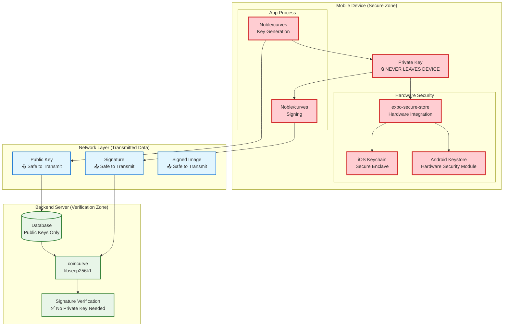

### **Security Guarantees by Library**

#### **Mobile Device (@noble/curves + expo-secure-store)**
- ✅ **Private Key Isolation**: Never transmitted, never exposed outside secure storage
- ✅ **Hardware Security**: iOS Keychain/Android Keystore with hardware backing
- ✅ **Secure Generation**: Cryptographically secure random number generation
- ✅ **Memory Protection**: Secure memory handling for private key operations
- ✅ **App Isolation**: Keys cannot be accessed by other applications

#### **Backend (coincurve + libsecp256k1)**
- ✅ **No Private Key Dependency**: Only needs public key for verification
- ✅ **Production-Grade Crypto**: Same library securing Bitcoin network
- ✅ **Constant-Time Operations**: Prevents timing attack vulnerabilities
- ✅ **Comprehensive Validation**: Multi-layer security checks before verification
- ✅ **Audit Trail**: Complete logging of verification attempts

---

## 5. Library-Specific Implementation Details

### **@noble/curves Implementation**
```typescript
// Pure JavaScript, no native dependencies
// Auditable source code
// Follows FIPS 186-4 and SEC 1 standards
// Constant-time algorithms where possible

import { secp256k1 } from '@noble/curves/secp256k1';

// Secure random private key generation
const privateKey = secp256k1.utils.randomPrivateKey();
// Uses crypto.getRandomValues() or Node.js crypto.randomBytes()

// Public key derivation using elliptic curve mathematics
const publicKey = secp256k1.getPublicKey(privateKey);
// Performs: P = d × G (where d = private key, G = generator point)

// ECDSA signature generation
const signature = secp256k1.sign(messageHash, privateKey);
// Generates (r, s) values following RFC 6979 deterministic k
```

### **expo-secure-store Implementation**
```typescript
// iOS Implementation (uses Keychain Services)
// - Data encrypted with hardware-derived keys
// - Stored in iOS Keychain with kSecAttrAccessibleWhenUnlockedThisDeviceOnly
// - Protected by Secure Enclave on supported devices (iPhone 5s+)

// Android Implementation (uses Android Keystore)
// - Hardware-backed encryption when available
// - AES encryption with hardware-derived keys
// - Protected by Android Hardware Security Module (HSM)

const SECURE_STORE_OPTIONS = {
  keychainService: 'com.geocam.secure.keychain', // iOS keychain service
  sharedPreferencesName: 'GeoCamSecurePrefs',    // Android encrypted prefs
  requireAuthentication: false, // Can enable for biometric protection
};
```

### **coincurve Implementation**
```python
# Python bindings to libsecp256k1 (Bitcoin Core library)
# Written in C for performance and security
# Used by Bitcoin network since 2015

import coincurve

# Initialize public key (validates format)
public_key = coincurve.PublicKey(public_key_bytes)
# - Validates 33-byte compressed format (0x02/0x03 prefix)
# - Ensures point is on secp256k1 curve
# - Uses libsecp256k1's secp256k1_ec_pubkey_parse()

# Verify signature (constant-time operation)
is_valid = public_key.verify(signature_bytes, message_hash, hasher=None)
# - Uses libsecp256k1's secp256k1_ecdsa_verify()
# - Constant-time algorithm prevents timing attacks
# - Returns boolean result of cryptographic verification
```

---

This comprehensive explanation shows how the combination of @noble/curves, expo-secure-store, and coincurve creates a secure system where private keys never leave the mobile device while enabling robust signature verification on the backend.

---

## 6. Complete Image Signing & Metadata Embedding Process

### Overview of Image Signing with Metadata

This section details how images are captured, enriched with metadata, cryptographically signed, and embedded with steganographic data to create tamper-evident, verifiable photos.

### **Complete Image Signing Flow**

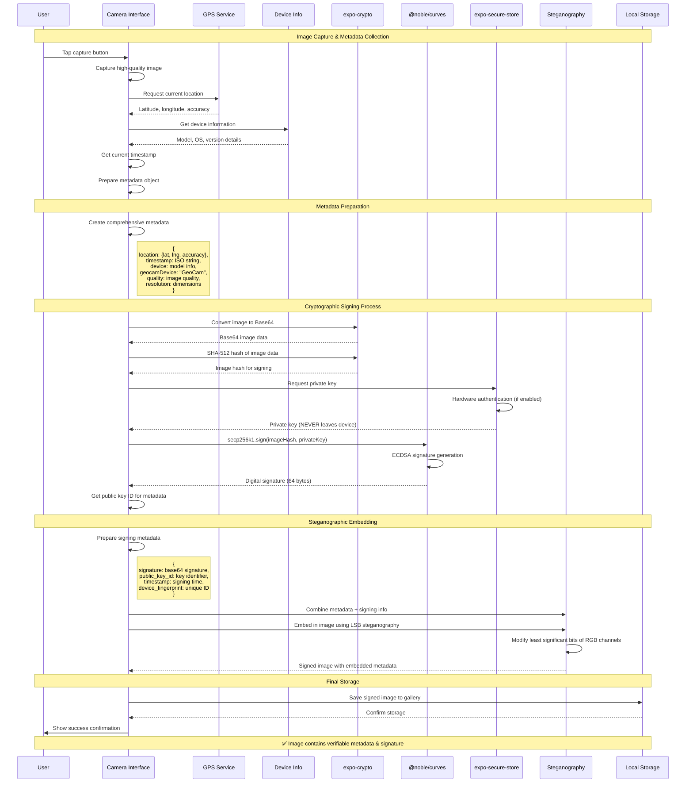

### **Detailed Metadata Structure**

#### **1. Location Metadata Collection**
```typescript
// GPS Location Collection
const getLocationMetadata = async () => {
  const location = await Location.getCurrentPositionAsync({
    accuracy: Location.Accuracy.Highest,
    timeInterval: 1000,
    distanceInterval: 1,
  });
  
  return {
    latitude: location.coords.latitude,
    longitude: location.coords.longitude,
    accuracy: location.coords.accuracy,
    altitude: location.coords.altitude,
    heading: location.coords.heading,
    speed: location.coords.speed,
    timestamp: location.timestamp,
  };
};
```

#### **2. Device Information Collection**
```typescript
// Device Metadata Collection
const getDeviceMetadata = async () => {
  return {
    geocamDevice: 'GeoCam', // App identifier
    deviceModel: Device.modelName || 'Unknown',
    osName: Device.osName || 'Unknown',
    osVersion: Device.osVersion || 'Unknown',
    deviceType: Device.deviceType,
    deviceYearClass: Device.deviceYearClass,
    manufacturer: Device.manufacturer,
    brand: Device.brand,
    deviceFingerprint: await generateDeviceFingerprint(),
  };
};
```

#### **3. Camera Settings Metadata**
```typescript
// Camera Configuration Metadata
const getCameraMetadata = (cameraSettings: any) => {
  return {
    quality: cameraSettings.quality || 1.0,
    aspectRatio: cameraSettings.ratio || '4:3',
    flashMode: cameraSettings.flashMode || 'off',
    focusMode: cameraSettings.focusMode || 'auto',
    whiteBalance: cameraSettings.whiteBalance || 'auto',
    zoom: cameraSettings.zoom || 0,
    orientation: cameraSettings.orientation || 'portrait',
  };
};
```

### **Complete Metadata Object Structure**

```typescript
interface GeoCamImageMetadata {
  // Core identification
  geocamDevice: string;           // "GeoCam"
  version: string;               // App version
  
  // Temporal information
  timestamp: string;             // ISO 8601 timestamp
  Time: string;                  // Human-readable time
  captureTime: number;           // Unix timestamp
  
  // Spatial information
  location: {
    latitude: number;
    longitude: number;
    accuracy: number;
    altitude?: number;
    heading?: number;
    speed?: number;
  };
  
  // Device information
  deviceModel: string;
  osName: string;
  osVersion: string;
  deviceType: number;
  manufacturer?: string;
  brand?: string;
  deviceFingerprint: string;
  
  // Camera settings
  quality: number;
  aspectRatio: string;
  flashMode: string;
  focusMode: string;
  whiteBalance: string;
  zoom: number;
  orientation: string;
  
  // Image properties
  resolution: {
    width: number;
    height: number;
  };
  fileSize: number;
  format: string;                // "jpeg", "png"
  
  // Cryptographic information
  signature: string;             // Base64 ECDSA signature
  public_key_id: string;         // Public key identifier
  device_fingerprint: string;    // Unique device ID
  image_hash: string;            // SHA-512 of image data
  signing_timestamp: string;     // When signature was created
}
```

### **Image Signing Implementation**

```typescript
export const captureAndSignImage = async (
  cameraRef: any, 
  cameraSettings: any
): Promise<SignedImageResult> => {
  try {
    console.log('📸 Starting secure image capture and signing...');
    
    // 1. CAPTURE IMAGE
    const photo = await cameraRef.current.takePictureAsync({
      quality: cameraSettings.quality,
      base64: true,
      exif: false, // We create our own metadata
    });
    
    // 2. COLLECT METADATA
    const [locationData, deviceData, cameraData] = await Promise.all([
      getLocationMetadata(),
      getDeviceMetadata(),
      Promise.resolve(getCameraMetadata(cameraSettings))
    ]);
    
    // 3. PREPARE COMPREHENSIVE METADATA
    const timestamp = new Date().toISOString();
    const metadata: GeoCamImageMetadata = {
      // Core identification
      geocamDevice: 'GeoCam',
      version: '1.0.0',
      
      // Temporal information
      timestamp,
      Time: new Date().toLocaleString(),
      captureTime: Date.now(),
      
      // Spatial information
      location: locationData,
      
      // Device information
      ...deviceData,
      
      // Camera settings
      ...cameraData,
      
      // Image properties
      resolution: {
        width: photo.width,
        height: photo.height,
      },
      fileSize: photo.base64?.length || 0,
      format: 'jpeg',
    };
    
    // 4. CRYPTOGRAPHIC SIGNING
    console.log('🔐 Signing image with device private key...');
    
    // Get private key from secure storage
    const privateKeyData = JSON.parse(
      await SecureStore.getItemAsync(PRIVATE_KEY_STORAGE_KEY, SECURE_STORE_OPTIONS)
    );
    const publicKeyData = JSON.parse(
      await SecureStore.getItemAsync(PUBLIC_KEY_STORAGE_KEY)
    );
    
    // Hash the image data
    const imageDataHash = await Crypto.digestStringAsync(
      Crypto.CryptoDigestAlgorithm.SHA512,
      photo.base64!,
      { encoding: Crypto.CryptoEncoding.HEX }
    );
    
    // Sign the image hash
    const privateKeyBytes = new Uint8Array(
      atob(privateKeyData.keyBase64).split('').map(c => c.charCodeAt(0))
    );
    const hashBytes = new Uint8Array(
      imageDataHash.match(/.{1,2}/g)!.map(byte => parseInt(byte, 16))
    );
    
    const signature = secp256k1.sign(hashBytes, privateKeyBytes);
    const signatureBase64 = btoa(String.fromCharCode(...signature.toCompactRawBytes()));
    
    // 5. ADD CRYPTOGRAPHIC METADATA
    const signedMetadata: GeoCamImageMetadata = {
      ...metadata,
      signature: signatureBase64,
      public_key_id: publicKeyData.keyId,
      device_fingerprint: privateKeyData.deviceFingerprint,
      image_hash: imageDataHash,
      signing_timestamp: new Date().toISOString(),
    };
    
    // 6. STEGANOGRAPHIC EMBEDDING
    console.log('🖼️ Embedding metadata using steganography...');
    
    const { embedMetadataInPng } = require('./backendService');
    const embeddedResult = await embedMetadataInPng(photo.base64!, signedMetadata);
    
    if (!embeddedResult.success) {
      throw new Error('Failed to embed metadata in image');
    }
    
    // 7. SAVE TO GALLERY
    const galleryData = {
      uri: photo.uri,
      encodedInfo: JSON.stringify(signedMetadata),
      signature: signatureBase64,
      publicKey: publicKeyData.keyBase64,
      timestamp: Date.now(),
    };
    
    await saveImageToGallery(galleryData);
    
    console.log('✅ Image signed and saved successfully');
    console.log('🔐 Signature:', signatureBase64.substring(0, 20) + '...');
    console.log('📊 Metadata items:', Object.keys(signedMetadata).length);
    console.log('📍 Location:', `${locationData.latitude}, ${locationData.longitude}`);
    
    return {
      success: true,
      imageUri: photo.uri,
      metadata: signedMetadata,
      signature: signatureBase64,
      publicKeyId: publicKeyData.keyId,
    };
    
  } catch (error) {
    console.error('❌ Image signing failed:', error);
    throw error;
  }
};
```

### **Steganographic Embedding Process**

#### **LSB (Least Significant Bit) Steganography Implementation**

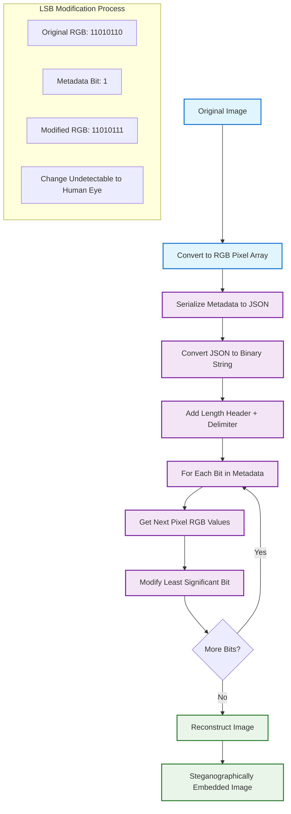

#### **Steganography Implementation Details**

```javascript
// Backend Steganography Service Implementation
async function embedMetadataInImage(imageBase64, metadata) {
  try {
    // 1. Convert base64 to image buffer
    const imageBuffer = Buffer.from(imageBase64, 'base64');
    const image = sharp(imageBuffer);
    const { data, info } = await image.raw().toBuffer({ resolveWithObject: true });
    
    // 2. Prepare metadata for embedding
    const metadataString = JSON.stringify(metadata);
    const metadataBuffer = Buffer.from(metadataString, 'utf8');
    
    // 3. Create header with metadata length
    const lengthHeader = Buffer.alloc(4);
    lengthHeader.writeUInt32BE(metadataBuffer.length);
    
    // 4. Combine header + metadata + delimiter
    const delimiter = Buffer.from('GEOCAM_END', 'utf8');
    const dataToEmbed = Buffer.concat([lengthHeader, metadataBuffer, delimiter]);
    
    // 5. Convert to binary string
    const binaryString = Array.from(dataToEmbed)
      .map(byte => byte.toString(2).padStart(8, '0'))
      .join('');
    
    // 6. Modify LSBs of image pixels
    const modifiedData = Buffer.from(data);
    let bitIndex = 0;
    
    for (let i = 0; i < modifiedData.length && bitIndex < binaryString.length; i++) {
      // Skip alpha channel (only modify RGB channels)
      if (info.channels === 4 && (i + 1) % 4 === 0) continue;
      
      // Get current pixel value and metadata bit
      const pixelValue = modifiedData[i];
      const metadataBit = parseInt(binaryString[bitIndex]);
      
      // Modify least significant bit
      const modifiedPixel = (pixelValue & 0xFE) | metadataBit;
      modifiedData[i] = modifiedPixel;
      
      bitIndex++;
    }
    
    // 7. Reconstruct image
    const modifiedImage = await sharp(modifiedData, {
      raw: {
        width: info.width,
        height: info.height,
        channels: info.channels
      }
    }).png().toBuffer();
    
    // 8. Convert back to base64
    const resultBase64 = modifiedImage.toString('base64');
    
    return {
      success: true,
      embeddedImage: resultBase64,
      metadataSize: metadataBuffer.length,
      bitsModified: binaryString.length,
      originalSize: data.length,
    };
    
  } catch (error) {
    console.error('❌ Steganography embedding failed:', error);
    return { success: false, error: error.message };
  }
}
```

### **Metadata Extraction Process**

```javascript
// Extract metadata from steganographically embedded image
async function extractMetadataFromImage(imageBase64) {
  try {
    // 1. Convert to raw pixel data
    const imageBuffer = Buffer.from(imageBase64, 'base64');
    const { data, info } = await sharp(imageBuffer).raw().toBuffer({ resolveWithObject: true });
    
    // 2. Extract length header (first 32 bits)
    let bitIndex = 0;
    let lengthBits = '';
    
    for (let i = 0; i < data.length && lengthBits.length < 32; i++) {
      if (info.channels === 4 && (i + 1) % 4 === 0) continue; // Skip alpha
      
      const lsb = data[i] & 1;
      lengthBits += lsb.toString();
    }
    
    const metadataLength = parseInt(lengthBits, 2);
    
    // 3. Extract metadata bits
    let metadataBits = '';
    const totalBitsNeeded = 32 + (metadataLength * 8) + 80; // header + data + delimiter
    
    for (let i = 0; i < data.length && metadataBits.length < totalBitsNeeded; i++) {
      if (info.channels === 4 && (i + 1) % 4 === 0) continue; // Skip alpha
      
      const lsb = data[i] & 1;
      metadataBits += lsb.toString();
    }
    
    // 4. Convert bits to bytes and extract JSON
    const metadataBytes = [];
    for (let i = 32; i < metadataBits.length; i += 8) {
      const byte = parseInt(metadataBits.substr(i, 8), 2);
      metadataBytes.push(byte);
    }
    
    const metadataBuffer = Buffer.from(metadataBytes);
    const metadataString = metadataBuffer.toString('utf8', 0, metadataLength);
    
    // 5. Parse JSON metadata
    const metadata = JSON.parse(metadataString);
    
    return {
      success: true,
      metadata,
      extractedLength: metadataLength,
    };
    
  } catch (error) {
    console.error('❌ Metadata extraction failed:', error);
    return { success: false, error: error.message };
  }
}
```

### **Security Considerations in Image Signing**

#### **1. Tamper Detection**
- **Image Hash**: SHA-512 hash of original image data before metadata embedding
- **Signature Verification**: ECDSA signature ensures image hasn't been modified
- **Metadata Integrity**: Any change to embedded data invalidates the signature

#### **2. Replay Attack Prevention**
- **Timestamp**: Each signature includes creation timestamp
- **Device Fingerprint**: Unique device identifier prevents key reuse
- **Nonce/Random Data**: Device fingerprint includes random component

#### **3. Privacy Protection**
- **Selective Metadata**: Only necessary information is embedded
- **Local Processing**: All signing happens on device, no data transmitted
- **User Control**: User can choose what metadata to include

#### **4. Steganographic Security**
- **Invisible Embedding**: LSB modifications are imperceptible to human eye
- **Robust Encoding**: Metadata survives normal image operations
- **Error Detection**: Delimiter and length headers ensure data integrity

This comprehensive process ensures that every GeoCam image contains verifiable proof of its authenticity, location, and capture details while maintaining the private key's security on the device.
