# GeoCam Image Verification Flow Diagram

## Overview
This diagram illustrates the complete image verification process in the GeoCam app, showing how images are selected, analyzed, and verified using cryptographic signatures and steganography.

## Key Components
- **Private Key**: Stored securely on device, never transmitted
- **Public Key**: Shared with backend for verification
- **Steganography Service**: Extracts hidden metadata from images
- **Signature Verification**: Validates image authenticity using cryptographic signatures

---

## Complete Verification Flow


---

## Detailed Verification Steps

### 1. Image Selection Phase


### 2. Steganography Extraction Phase


### 3. Signature Verification Phase


### 4. Key Management Flow


---

## Data Flow Architecture

### 1. Metadata Processing


### 2. UI State Management


---

## Security Model

### Key Security Principles
1. **Private Key Isolation**: Private keys never leave the device
2. **Public Key Distribution**: Only public keys are transmitted to backend
3. **Signature Verification**: Backend uses public key to verify signatures
4. **Secure Storage**: Private keys stored in device secure storage
5. **No Key Transmission**: Verification process doesn't require private key transmission

### Cryptographic Flow

```mermaid
graph TB
    subgraph "Device Security Boundary"
        PK[Private Key<br/>🔒 Secure Storage]
        SIG[Sign Image<br/>🔐 Private Key]
        META[Embed Metadata<br/>📊 Steganography]
    end
    
    subgraph "Network Layer"
        PUB[Public Key<br/>📤 Transmitted]
        IMG[Signed Image<br/>📸 With Metadata]
    end
    
    subgraph "Backend Verification"
        STORE[Public Key Storage<br/>🗃️ Database]
        VERIFY[Signature Verification<br/>✅ Public Key]
        RESULT[Verification Result<br/>📋 Authentic/Invalid]
    end
    
    PK --> SIG
    SIG --> META
    META --> IMG
    PK --> PUB
    PUB --> STORE
    IMG --> VERIFY
    STORE --> VERIFY
    VERIFY --> RESULT
    
    classDef secure fill:#ffcdd2,stroke:#d32f2f,stroke-width:3px
    classDef network fill:#e1f5fe,stroke:#1976d2,stroke-width:2px
    classDef backend fill:#e8f5e8,stroke:#2e7d32,stroke-width:2px
    
    class PK,SIG,META secure
    class PUB,IMG network
    class STORE,VERIFY,RESULT backend
```


---

## Error Handling Flow


---

## Implementation Notes

### Key Technologies Used
- **React Native**: Mobile app framework
- **Expo**: Development platform and tools
- **AsyncStorage**: Local data persistence
- **Secure Storage**: Cryptographic key storage
- **File System**: Image file operations
- **Image Picker**: System image selection
- **Maps**: Location visualization
- **Steganography**: Hidden data embedding/extraction
- **Cryptographic Signatures**: Image authentication

### Performance Considerations
- Progress animation during verification (25-second simulation)
- Lazy loading of verification results
- Efficient Base64 conversion
- Optimized map rendering
- Smooth UI transitions

### User Experience Features
- Empty state with clear call-to-action
- Progress feedback during verification
- Animated scroll indicators
- Bottom sheet for source selection
- Responsive design for different screen sizes
- Dark/light theme support
- Import mode for external images

This comprehensive flow diagram illustrates how the GeoCam verification system maintains security while providing a seamless user experience for image authenticity verification.

---

## Complete Key Generation & Management Process

### Overview of Cryptographic Libraries and Their Roles

This section details the complete process from key generation to image verification, explaining how each library ensures private keys never leave the mobile device while enabling secure verification.

---

## 1. Private & Public Key Generation Process

### **Mobile Device Key Generation (Using @noble/curves)**


### **Library Responsibilities in Key Generation**

#### **@noble/curves v1.9.2 (Mobile Device)**
```typescript
// 1. Secure Private Key Generation
const privateKeyBytes = secp256k1.utils.randomPrivateKey();
// - Uses cryptographically secure random number generator
// - Generates 32-byte private key following secp256k1 standards
// - NO network dependencies, pure JavaScript implementation

// 2. Public Key Derivation
const publicKeyPoint = secp256k1.getPublicKey(privateKeyBytes);
// - Performs elliptic curve point multiplication: P = privateKey × G
// - Generates compressed 33-byte public key
// - Mathematically linked but computationally infeasible to reverse
```

#### **expo-secure-store v14.2.3 (Mobile Device)**
```typescript
// Hardware-Backed Secure Storage
await SecureStore.setItemAsync(
  PRIVATE_KEY_STORAGE_KEY,
  JSON.stringify(privateKeyData),
  {
    requireAuthentication: false, // Can enable biometric auth
    authenticationPrompt: 'Authenticate to access GeoCam keys',
    keychainService: 'com.geocam.secure.keychain',
    // iOS: Uses Keychain Services with hardware security
    // Android: Uses Android Keystore with hardware backing
  }
);
```

**Security Features:**
- **iOS Keychain**: Hardware-backed encryption using Secure Enclave (iPhone 5s+)
- **Android Keystore**: Hardware Security Module (HSM) when available
- **Biometric Protection**: Optional TouchID/FaceID/Fingerprint authentication
- **App Isolation**: Keys isolated per app, cannot be accessed by other apps
- **Device-Specific Encryption**: Keys encrypted with device-specific hardware keys

#### **expo-crypto v13.1.0 (Mobile Device)**
```typescript
// Device Fingerprint Generation
const deviceInfo = {
  model: Device.modelName,
  osName: Device.osName,
  osVersion: Device.osVersion,
  deviceType: Device.deviceType,
  randomComponent: await Crypto.getRandomBytesAsync(16) // Unique per installation
};

const fingerprint = await Crypto.digestStringAsync(
  Crypto.CryptoDigestAlgorithm.SHA256,
  JSON.stringify(deviceInfo),
  { encoding: Crypto.CryptoEncoding.HEX }
);
```

---

## 2. Image Signing Process (Private Key Usage)

### **Secure Image Signing Flow**

```mermaid
sequenceDiagram
    participant Camera as Camera Module
    participant App as Mobile App
    participant SecStore as expo-secure-store
    participant Noble as @noble/curves
    participant Crypto as expo-crypto
    participant Steg as Steganography
    
    Note over Camera,Steg: Image Capture & Signing Process
    
    Camera->>App: Captured image data
    App->>Crypto: SHA-512 hash of image data
    Crypto-->>App: Image hash (for signing)
    
    App->>SecStore: Request private key (with auth if enabled)
    SecStore->>SecStore: Hardware authentication check
    SecStore-->>App: Private key (NEVER leaves secure storage)
    
    App->>Noble: secp256k1.sign(imageHash, privateKey)
    Noble->>Noble: ECDSA signature generation
    Noble-->>App: Digital signature (64 bytes)
    
    App->>App: Prepare metadata with signature + public key ID
    App->>Steg: Embed metadata in image using LSB steganography
    Steg-->>App: Signed image with embedded metadata
    
    Note over App: ✅ Private key used locally, never transmitted
```



### **Image Signing Implementation Details**

```typescript
export const signImageDataSecurely = async (imageData: string, metadata: any): Promise<SignedImageData> => {
  // 1. Get private key from secure storage (NEVER transmitted)
  const privateKeyData = JSON.parse(
    await SecureStore.getItemAsync(PRIVATE_KEY_STORAGE_KEY, SECURE_STORE_OPTIONS)
  );
  
  // 2. Hash image data for signing
  const imageDataHash = await Crypto.digestStringAsync(
    Crypto.CryptoDigestAlgorithm.SHA512,
    imageData,
    { encoding: Crypto.CryptoEncoding.HEX }
  );
  
  // 3. Convert private key from storage format
  const privateKeyBytes = new Uint8Array(
    atob(privateKeyData.keyBase64).split('').map(c => c.charCodeAt(0))
  );
  
  // 4. Sign the image hash using secp256k1
  const hashBytes = new Uint8Array(
    imageDataHash.match(/.{1,2}/g)!.map(byte => parseInt(byte, 16))
  );
  
  const signature = secp256k1.sign(hashBytes, privateKeyBytes);
  const signatureBase64 = btoa(String.fromCharCode(...signature.toCompactRawBytes()));
  
  return {
    signature: signatureBase64,
    publicKeyId: publicKeyData.keyId, // Only public key ID transmitted
    timestamp: new Date().toISOString(),
    metadata
  };
};
```

---

## 3. Backend Verification Process (Using coincurve)

### **Backend Signature Verification Flow**


### **coincurve Library Role in Backend Verification**

#### **What coincurve Does:**
```python
def verify_secp256k1_signature(signature_base64: str, data_hash: str, public_key_base64: str) -> dict:
    """Production-grade signature verification using coincurve"""
    
    # 1. Decode binary data
    signature_bytes = base64.b64decode(signature_base64)  # 64 bytes
    public_key_bytes = base64.b64decode(public_key_base64)  # 33 bytes
    hash_bytes = bytes.fromhex(data_hash)  # 64 bytes (SHA-512)
    
    # 2. Initialize public key with libsecp256k1
    public_key = coincurve.PublicKey(public_key_bytes)
    # - coincurve wraps the Bitcoin Core libsecp256k1 library
    # - Provides production-grade, battle-tested cryptographic operations
    # - Used by Bitcoin network for over a decade
    
    # 3. Verify signature using constant-time algorithms
    signature_verified = public_key.verify(signature_bytes, hash_bytes, hasher=None)
    # - Performs ECDSA verification: e = H(m), r,s = signature, P = public_key
    # - Verifies: r == (H(m) × s^(-1) × G + r × s^(-1) × P).x mod n
    # - Constant-time operation prevents timing attacks
    
    return {'valid': signature_verified}
```

#### **Why coincurve is Critical for Security:**

1. **Production-Grade Library**: Python bindings to libsecp256k1 (Bitcoin Core)
2. **Constant-Time Operations**: Prevents timing attack vulnerabilities
3. **Memory Safety**: Secure memory handling for cryptographic operations
4. **Battle-Tested**: Same library securing billions of dollars in Bitcoin
5. **Comprehensive Validation**: Proper format and cryptographic verification

---

## 4. Complete Security Architecture

### **Key Security Boundaries**

```mermaid
graph TB
    subgraph "Mobile Device (Secure Zone)"
        subgraph "App Process"
            NG[Noble/curves<br/>Key Generation]
            NS[Noble/curves<br/>Signing]
        end
        
        subgraph "Hardware Security"
            IOS[iOS Keychain<br/>Secure Enclave]
            AND[Android Keystore<br/>Hardware Security Module]
            SS[expo-secure-store<br/>Hardware Integration]
        end
        
        PK[Private Key<br/>🔒 NEVER LEAVES DEVICE]
        
        NG --> PK
        PK --> SS
        SS --> IOS
        SS --> AND
        PK --> NS
    end
    
    subgraph "Network Layer (Transmitted Data)"
        PUB[Public Key<br/>📤 Safe to Transmit]
        SIG[Signature<br/>📤 Safe to Transmit]
        IMG[Signed Image<br/>📤 Safe to Transmit]
        
        NS --> SIG
        NG --> PUB
    end
    
    subgraph "Backend Server (Verification Zone)"
        DB[(Database<br/>Public Keys Only)]
        CC[coincurve<br/>libsecp256k1]
        VER[Signature Verification<br/>✅ No Private Key Needed]
        
        PUB --> DB
        DB --> CC
        SIG --> CC
        CC --> VER
    end
    
    classDef secure fill:#ffcdd2,stroke:#d32f2f,stroke-width:3px
    classDef transmitted fill:#e1f5fe,stroke:#1976d2,stroke-width:2px
    classDef backend fill:#e8f5e8,stroke:#2e7d32,stroke-width:2px
    
    class NG,NS,PK,SS,IOS,AND secure
    class PUB,SIG,IMG transmitted
    class DB,CC,VER backend
```



### **Security Guarantees by Library**

#### **Mobile Device (@noble/curves + expo-secure-store)**
- ✅ **Private Key Isolation**: Never transmitted, never exposed outside secure storage
- ✅ **Hardware Security**: iOS Keychain/Android Keystore with hardware backing
- ✅ **Secure Generation**: Cryptographically secure random number generation
- ✅ **Memory Protection**: Secure memory handling for private key operations
- ✅ **App Isolation**: Keys cannot be accessed by other applications

#### **Backend (coincurve + libsecp256k1)**
- ✅ **No Private Key Dependency**: Only needs public key for verification
- ✅ **Production-Grade Crypto**: Same library securing Bitcoin network
- ✅ **Constant-Time Operations**: Prevents timing attack vulnerabilities
- ✅ **Comprehensive Validation**: Multi-layer security checks before verification
- ✅ **Audit Trail**: Complete logging of verification attempts

---

## 5. Library-Specific Implementation Details

### **@noble/curves Implementation**
```typescript
// Pure JavaScript, no native dependencies
// Auditable source code
// Follows FIPS 186-4 and SEC 1 standards
// Constant-time algorithms where possible

import { secp256k1 } from '@noble/curves/secp256k1';

// Secure random private key generation
const privateKey = secp256k1.utils.randomPrivateKey();
// Uses crypto.getRandomValues() or Node.js crypto.randomBytes()

// Public key derivation using elliptic curve mathematics
const publicKey = secp256k1.getPublicKey(privateKey);
// Performs: P = d × G (where d = private key, G = generator point)

// ECDSA signature generation
const signature = secp256k1.sign(messageHash, privateKey);
// Generates (r, s) values following RFC 6979 deterministic k
```

### **expo-secure-store Implementation**
```typescript
// iOS Implementation (uses Keychain Services)
// - Data encrypted with hardware-derived keys
// - Stored in iOS Keychain with kSecAttrAccessibleWhenUnlockedThisDeviceOnly
// - Protected by Secure Enclave on supported devices (iPhone 5s+)

// Android Implementation (uses Android Keystore)
// - Hardware-backed encryption when available
// - AES encryption with hardware-derived keys
// - Protected by Android Hardware Security Module (HSM)

const SECURE_STORE_OPTIONS = {
  keychainService: 'com.geocam.secure.keychain', // iOS keychain service
  sharedPreferencesName: 'GeoCamSecurePrefs',    // Android encrypted prefs
  requireAuthentication: false, // Can enable for biometric protection
};
```

### **coincurve Implementation**
```python
# Python bindings to libsecp256k1 (Bitcoin Core library)
# Written in C for performance and security
# Used by Bitcoin network since 2015

import coincurve

# Initialize public key (validates format)
public_key = coincurve.PublicKey(public_key_bytes)
# - Validates 33-byte compressed format (0x02/0x03 prefix)
# - Ensures point is on secp256k1 curve
# - Uses libsecp256k1's secp256k1_ec_pubkey_parse()

# Verify signature (constant-time operation)
is_valid = public_key.verify(signature_bytes, message_hash, hasher=None)
# - Uses libsecp256k1's secp256k1_ecdsa_verify()
# - Constant-time algorithm prevents timing attacks
# - Returns boolean result of cryptographic verification
```

---

This comprehensive explanation shows how the combination of @noble/curves, expo-secure-store, and coincurve creates a secure system where private keys never leave the mobile device while enabling robust signature verification on the backend.
