# GeoCam Image Verification Flow Diagram

## Overview
This diagram illustrates the complete image verification process in the GeoCam app, showing how images are selected, analyzed, and verified using cryptographic signatures and steganography.

## Key Components
- **Private Key**: Stored securely on device, never transmitted
- **Public Key**: Shared with backend for verification
- **Steganography Service**: Extracts hidden metadata from images
- **Signature Verification**: Validates image authenticity using cryptographic signatures

---

## Complete Verification Flow

---

## Detailed Verification Steps

### 1. Image Selection Phase

### 2. Steganography Extraction Phase

### 3. Signature Verification Phase

### 4. Key Management Flow

```mermaid
graph LR
    subgraph "Device (Secure)"
        A[Generate Private Key] --> B[Store in Secure Storage]
        A --> C[Derive Public Key]
        B --> D[Private Key Never Leaves Device]
    end
    
    subgraph "Network Communication"
        C --> E[Send Public Key to Backend]
        E --> F[Backend Stores Public Key]
    end
    
    subgraph "Verification Process"
        F --> G[Retrieve Public Key for Verification]
        G --> H[Verify Signature]
        H --> I[Return Validation Result]
    end
    
    classDef secure fill:#ffcdd2,stroke:#d32f2f,stroke-width:3px
    classDef network fill:#e1f5fe,stroke:#1976d2,stroke-width:2px
    classDef process fill:#f3e5f5,stroke:#7b1fa2,stroke-width:2px
    
    class A,B,D secure
    class C,E,F network
    class G,H,I process
```

---

## Data Flow Architecture

### 1. Metadata Processing

### 2. UI State Management

---

## Security Model

### Key Security Principles
1. **Private Key Isolation**: Private keys never leave the device
2. **Public Key Distribution**: Only public keys are transmitted to backend
3. **Signature Verification**: Backend uses public key to verify signatures
4. **Secure Storage**: Private keys stored in device secure storage
5. **No Key Transmission**: Verification process doesn't require private key transmission

### Cryptographic Flow

```mermaid
graph TB
    subgraph "Device Security Boundary"
        PK[Private Key<br/>🔒 Secure Storage]
        SIG[Sign Image<br/>🔐 Private Key]
        META[Embed Metadata<br/>📊 Steganography]
    end
    
    subgraph "Network Layer"
        PUB[Public Key<br/>📤 Transmitted]
        IMG[Signed Image<br/>📸 With Metadata]
    end
    
    subgraph "Backend Verification"
        STORE[Public Key Storage<br/>🗃️ Database]
        VERIFY[Signature Verification<br/>✅ Public Key]
        RESULT[Verification Result<br/>📋 Authentic/Invalid]
    end
    
    PK --> SIG
    SIG --> META
    META --> IMG
    PK --> PUB
    PUB --> STORE
    IMG --> VERIFY
    STORE --> VERIFY
    VERIFY --> RESULT
    
    classDef secure fill:#ffcdd2,stroke:#d32f2f,stroke-width:3px
    classDef network fill:#e1f5fe,stroke:#1976d2,stroke-width:2px
    classDef backend fill:#e8f5e8,stroke:#2e7d32,stroke-width:2px
    
    class PK,SIG,META secure
    class PUB,IMG network
    class STORE,VERIFY,RESULT backend
```

---

## Error Handling Flow

---

## Implementation Notes

### Key Technologies Used
- **React Native**: Mobile app framework
- **Expo**: Development platform and tools
- **AsyncStorage**: Local data persistence
- **Secure Storage**: Cryptographic key storage
- **File System**: Image file operations
- **Image Picker**: System image selection
- **Maps**: Location visualization
- **Steganography**: Hidden data embedding/extraction
- **Cryptographic Signatures**: Image authentication

### Performance Considerations
- Progress animation during verification (25-second simulation)
- Lazy loading of verification results
- Efficient Base64 conversion
- Optimized map rendering
- Smooth UI transitions

### User Experience Features
- Empty state with clear call-to-action
- Progress feedback during verification
- Animated scroll indicators
- Bottom sheet for source selection
- Responsive design for different screen sizes
- Dark/light theme support
- Import mode for external images

This comprehensive flow diagram illustrates how the GeoCam verification system maintains security while providing a seamless user experience for image authenticity verification.
