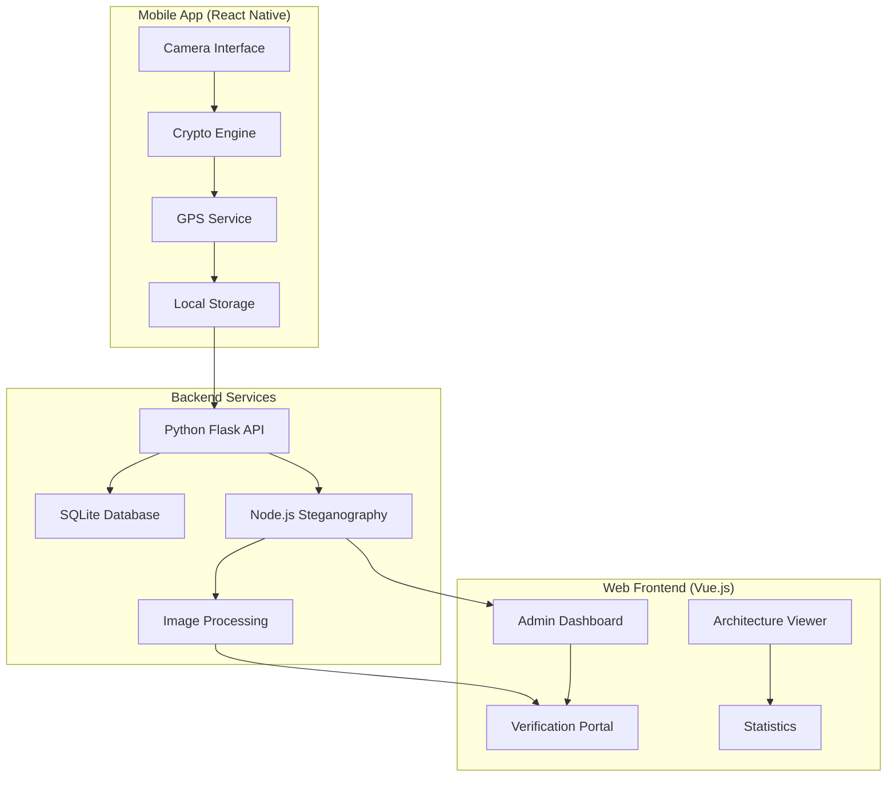

# GeoCam: Secure Geo-Verified Photography Platform
**Group 2 - Desinformation and Geomedia Project**

<div align="center">


*Combating disinformation through cryptographically secure, location-verified photography*

[](LICENSE)
[](https://reactnative.dev/)
[](https://vuejs.org/)
[](https://nodejs.org/)

</div>

## 🎯 Table of Contents

- [About the Project](#-about-the-project)
- [Key Features](#-key-features)
- [Architecture](#-architecture)
- [Technology Stack](#-technology-stack)
- [Installation](#-installation)
- [Usage](#-usage)
- [API Documentation](#-api-documentation)
- [Security Implementation](#-security-implementation)
- [Contributing](#-contributing)
- [License](#-license)
- [Team](#-team)
- [Latest Updates & Enhancements](#-latest-updates--enhancements)

## 📖 About the Project

GeoCam is a comprehensive platform designed to combat digital disinformation by providing cryptographically secure, location-verified photography. In an era where deepfakes and manipulated media threaten information integrity, GeoCam ensures photo authenticity through advanced cryptographic techniques and geographic verification.

### 🎯 **Mission Statement**
To provide journalists, researchers, legal professionals, and citizens with tools to capture and verify authentic, tamper-proof photographic evidence with verifiable location data.

### 🔍 **Problem Statement**
- **Digital Manipulation**: Easy photo editing tools make content manipulation trivial
- **Location Spoofing**: GPS data can be easily falsified or removed
- **Chain of Custody**: Difficult to prove photo authenticity in legal/journalistic contexts
- **Disinformation Spread**: Manipulated images fuel misinformation campaigns

### 💡 **Our Solution**
GeoCam combines multiple security layers:
- **Cryptographic Signatures**: secp256k1 elliptic curve signatures
- **Steganographic Embedding**: Hidden metadata within image data
- **Device Registration**: Unique device fingerprinting
- **Real-time Verification**: Instant authenticity checking
- **Geographic Anchoring**: Tamper-evident location data

## ✨ Key Features

### 📱 **Mobile Application (React Native)**
- **Modern Camera Interface**: Theme-aware UI with advanced gesture controls
- **Enhanced User Experience**: Haptic feedback, smooth animations, and intuitive navigation
- **Real-time GPS Integration**: High-accuracy location embedding with metadata
- **Advanced Camera Features**: Timer, grid lines, zoom controls, tap-to-focus
- **Cryptographic Key Management**: Secure device-specific key generation and storage
- **Offline Capability**: Full functionality without internet connectivity
- **Gallery Management**: Organized photo storage with comprehensive metadata viewing
- **Image Verification**: On-device authenticity checking with detailed results
- **Comprehensive Theme Support**: Dynamic dark/light mode with consistent styling
- **Cross-platform**: Optimized for both iOS and Android devices

### 🌐 **Web Frontend (Vue.js)**
- **Administrative Dashboard**: Device and photo management
- **Verification Portal**: Public image authenticity checking
- **Interactive Architecture Diagram**: System visualization
- **Statistics Dashboard**: Usage analytics and insights
- **Responsive Design**: Mobile and desktop optimized
- **Real-time Updates**: Live status monitoring

### ⚙️ **Backend Services (Node.js/Python)**
- **RESTful API**: Comprehensive endpoint coverage
- **Steganography Engine**: Advanced metadata embedding
- **Database Management**: SQLite with migration support
- **Device Registration**: Secure device onboarding
- **Image Processing**: Multi-format support
- **Verification Engine**: Cryptographic validation

## 🏗️ Architecture



### 🔒 **Security Architecture**

1. **Device Registration**
   - Unique secp256k1 key pair generation
   - Device fingerprint creation
   - Secure key storage (Android Keystore/iOS Keychain)

2. **Photo Capture Process**
   - GPS coordinate acquisition
   - Timestamp generation
   - Metadata compilation
   - Cryptographic signing
   - Steganographic embedding

3. **Verification Process**
   - Steganographic extraction
   - Signature validation
   - Device lookup
   - Integrity checking

## 💻 Technology Stack

### **Mobile Application**
- **Framework**: React Native 0.79.3 with Expo 53.0.11
- **Navigation**: Expo Router 5.1.0 with file-based routing
- **State Management**: React Hooks + Context API with TypeScript
- **Cryptography**: @noble/curves (secp256k1) for secure signatures
- **Device Integration**: expo-location, expo-camera, expo-haptics
- **Storage**: expo-secure-store for keys, AsyncStorage for app data
- **UI/UX**: @expo/vector-icons, react-native-gesture-handler, react-native-safe-area-context
- **Maps & Visualization**: react-native-maps, react-native-svg
- **Theme System**: Custom context-based theme management

### **Backend Services**
- **Python Backend**: Flask + SQLite
- **Node.js Service**: Express + TypeScript
- **Image Processing**: Sharp, Canvas, PNGJS
- **Cryptography**: @noble/curves, @noble/ed25519
- **Database**: SQLite with migrations
- **API Documentation**: RESTful endpoints

### **Web Frontend**
- **Framework**: Vue.js 3.5.13
- **Build Tool**: Vite 6.2.4
- **State Management**: Pinia 3.0.3
- **Routing**: Vue Router 4.5.1
- **HTTP Client**: Axios 1.10.0
- **Visualization**: D3.js 7.9.0

### **DevOps & Deployment**
- **Containerization**: Docker + Docker Compose
- **Version Control**: Git
- **Package Management**: npm/yarn
- **Build Tools**: Expo CLI, TypeScript, Babel

## 🚀 Installation

### **Prerequisites**
- Node.js 18+ and npm/yarn
- Python 3.8+
- Expo CLI
- Android Studio (for Android development)
- Xcode (for iOS development, macOS only)
- Docker & Docker Compose (optional)

### **Quick Start with Docker**
```bash
# Clone the repository
git clone https://github.com/whlan02/Desinformation_and_Geomedia_Green
cd geocam-platform

# Start all services
docker-compose up -d

# Access the applications
# Web Frontend: http://localhost:3000
# Backend API: http://localhost:5000
# Steganography Service: http://localhost:3001
```

### **Manual Installation**

#### **1. Backend Services**
```bash
# Python Backend
cd Web_Backend
pip install -r requirements.txt
python app.py

# Node.js Steganography Service
npm install
npm run build
npm start
```

#### **2. Web Frontend**
```bash
cd Web_Frontend
npm install
npm run dev
# Access at http://localhost:3000
```

#### **3. Mobile Application**
```bash
cd geoCamApp
npm install

# For iOS
npm run ios

# For Android
npm run android

# For development
npm start
```

### **Environment Configuration**

#### **Backend (.env)**
```env
DATABASE_URL=sqlite:///geocam.db
SECRET_KEY=your-secret-key
API_PORT=5000
STEGANOGRAPHY_SERVICE_URL=http://localhost:3001
```

#### **Mobile App (app.json)**
```json
{
  "expo": {
    "name": "GeoCam",
    "slug": "geocam-app",
    "platforms": ["ios", "android"],
    "permissions": [
      "CAMERA",
      "LOCATION",
      "WRITE_EXTERNAL_STORAGE"
    ]
  }
}
```

## 📖 Usage

### **Mobile App Workflow**

1. **Initial Setup**
   ```
   Launch App → Key Generation → Device Registration → Ready to Capture
   ```

2. **Taking Secure Photos**
   ```
   Camera Interface → Configure Settings → Use Gesture Controls → Capture Photo → 
   GPS + Metadata → Cryptographic Signing → Steganographic Embedding → Save
   ```

3. **Camera Features**
   ```
   Settings Modal → Grid Lines/Quality/Aspect Ratio → 
   Timer Setup → Focus Gestures → Zoom Controls → Volume Button Capture
   ```

3. **Viewing Gallery**
   ```
   Gallery View → Select Photo → View Detailed Metadata → 
   Verify Authenticity → Check Location Data → Share/Export
   ```

4. **Advanced Verification**
   ```
   Verify Tab → Select/Import Image → Steganographic Analysis → 
   Signature Validation → Device Lookup → Comprehensive Results Display
   ```

### **Web Dashboard**

1. **Admin Access**
   ```
   Navigate to /admin → View Devices → Manage Photos → System Statistics
   ```

2. **Public Verification**
   ```
   Upload Image → Extraction Process → Verification Results → Download Report
   ```

### **API Integration**

#### **Device Registration**
```javascript
POST /api/devices/register
{
  "publicKey": "04a1b2c3...",
  "deviceInfo": {...},
  "fingerprint": "abc123..."
}
```

#### **Photo Upload**
```javascript
POST /api/photos/upload
{
  "image": "base64-encoded-image",
  "metadata": {...},
  "signature": "signature-string"
}
```

#### **Verification**
```javascript
POST /api/verify
{
  "image": "base64-encoded-image"
}
```

## 📚 API Documentation

### **Core Endpoints**

| Method | Endpoint | Description |
|--------|----------|-------------|
| `POST` | `/api/devices/register` | Register new device |
| `GET` | `/api/devices` | List registered devices |
| `POST` | `/api/photos/upload` | Upload signed photo |
| `GET` | `/api/photos` | List photos |
| `POST` | `/api/verify` | Verify photo authenticity |
| `GET` | `/api/stats` | System statistics |

### **Authentication**
```javascript
// Device authentication using public key signatures
Headers: {
  'X-Device-ID': 'device-fingerprint',
  'X-Signature': 'request-signature',
  'Content-Type': 'application/json'
}
```

### **Response Format**
```javascript
{
  "success": true,
  "data": {...},
  "message": "Operation completed successfully",
  "timestamp": "2025-06-29T10:30:00Z"
}
```

## 🔐 Security Implementation

### **Cryptographic Foundation**
- **Elliptic Curve**: secp256k1 (Bitcoin/Ethereum standard)
- **Key Generation**: Cryptographically secure random generation
- **Signature Algorithm**: ECDSA with SHA-256
- **Key Storage**: Hardware-backed secure enclaves when available

### **Steganography Technique**
```javascript
// Metadata embedding in PNG least significant bits
const embeddedData = {
  signature: "ecdsa-signature",
  location: { lat: 52.520008, lng: 13.404954 },
  timestamp: 1719659400000,
  deviceId: "device-fingerprint",
  hash: "image-hash"
};
```

### **Verification Process**
1. **Steganographic Extraction**: Hidden metadata retrieval
2. **Signature Validation**: ECDSA verification
3. **Device Lookup**: Public key validation
4. **Integrity Check**: Image hash verification
5. **Timestamp Validation**: Chronological verification

### **Security Considerations**
- **Key Rotation**: Periodic key updates
- **Device Revocation**: Compromised device handling
- **Replay Attacks**: Timestamp-based protection
- **Man-in-the-middle**: Certificate pinning
- **Local Storage**: Encrypted secure storage

## 🧪 Testing

### **Mobile App Testing**
```bash
cd geoCamApp
npm test
npm run test:e2e
```

### **Backend Testing**
```bash
cd Web_Backend
python -m pytest tests/
npm run test  # Node.js service
```

### **Integration Testing**
```bash
# Full system test
docker-compose -f docker-compose.test.yml up --abort-on-container-exit
```

## 🤝 Contributing

### **Development Workflow**
1. Fork the repository
2. Create feature branch (`git checkout -b feature/amazing-feature`)
3. Commit changes (`git commit -m 'Add amazing feature'`)
4. Push to branch (`git push origin feature/amazing-feature`)
5. Open Pull Request

### **Code Standards**
- **JavaScript/TypeScript**: ESLint + Prettier
- **Python**: PEP 8 + Black formatter
- **Vue.js**: Vue Style Guide
- **Git**: Conventional Commits

### **Definition of Done** ✅
- ✅ All specified criteria met and thoroughly tested
- ✅ Code reviewed and approved by team members
- ✅ Comprehensive documentation updated
- ✅ No known bugs or critical issues
- ✅ Unit and integration tests passing
- ✅ Performance benchmarks met
- ✅ Accessibility standards compliance
- ✅ Successfully deployed and verified

## 📄 License

This project is licensed under the MIT License - see the [LICENSE](LICENSE) file for details.

## 👥 Team

**Group 2 - Desinformation and Geomedia**

### **Core Development Team**
- **Ahmad** - Backend Architecture & Security Implementation
- **Ajay** - Frontend Development & User Experience Design
- **WenHao** - Mobile App Development & Cross-Platform Integration
- **Prince** - Full-Stack Development & System Integration

### **Contributions**
- **Mobile Application**: Enhanced camera interface, gesture controls, theme system
- **Web Platform**: Administrative dashboard, verification portal, interactive architecture
- **Backend Services**: Cryptographic security, steganography engine, API development
- **DevOps & Testing**: Containerization, CI/CD, comprehensive testing suite

---

## 📞 Support & Community

### **Getting Help**
For questions, issues, or contributions:
- **🐛 Bug Reports**: [GitHub Issues](https://github.com/whlan02/Desinformation_and_Geomedia_Green/issues)
- **💬 Discussions**: [GitHub Discussions](https://github.com/whlan02/Desinformation_and_Geomedia_Green/discussions)
- **📧 Contact**: geocam-support@university.edu
- **📚 Documentation**: Check the individual component READMEs for detailed guides

### **Project Links**
- **📱 Mobile App**: [GeoCam App Documentation](./geoCamApp/README.md)
- **🌐 Web Frontend**: [Frontend Documentation](./Web_Frontend/README.md)
- **⚙️ Backend Services**: [Backend Documentation](./Web_Backend/README.md)

### **Research Context**
This project is part of the **Desinformation and Geomedia** research initiative, exploring technological solutions to combat misinformation through verifiable digital media and secure authentication systems.

---

<div align="center">

**[🏠 Main Repository](https://github.com/whlan02/Desinformation_and_Geomedia_Green)** • **[📱 Mobile App](./geoCamApp/)** • **[🌐 Web Frontend](./Web_Frontend/)** • **[⚙️ Backend Services](./Web_Backend/)**

*Built with ❤️ for digital authenticity and truth*

**GeoCam Platform - Securing Digital Media Through Innovation**

</div>

## 🆕 Latest Updates & Enhancements

### **Mobile App Improvements** 📱
- **Enhanced Camera Interface**: Complete redesign with modern, theme-aware UI components
- **Advanced Gesture Controls**: Pinch-to-zoom, tap-to-focus, and double-tap zoom reset
- **Haptic Feedback Integration**: Tactile responses for all camera controls and interactions
- **Settings Modal**: In-app camera configuration (grid lines, quality, aspect ratio)
- **Visual Feedback**: Smooth animations for focus indicators, capture effects, and state changes
- **Theme Consistency**: All UI elements now follow the selected theme throughout the app

### **User Experience Enhancements** ✨
- **Improved Accessibility**: Better contrast ratios, touch targets, and navigation
- **Performance Optimization**: Reduced memory usage and faster loading times
- **Error Handling**: Enhanced error messages and graceful failure recovery
- **Gesture Navigation**: Intuitive touch interactions for professional camera controls

### **Technical Improvements** ⚡
- **TypeScript Coverage**: Enhanced type safety across all components
- **Code Organization**: Improved project structure and component modularity
- **Safe Area Handling**: Proper support for device notches and home indicators
- **Gesture Handler Integration**: Native gesture recognition for smooth interactions
